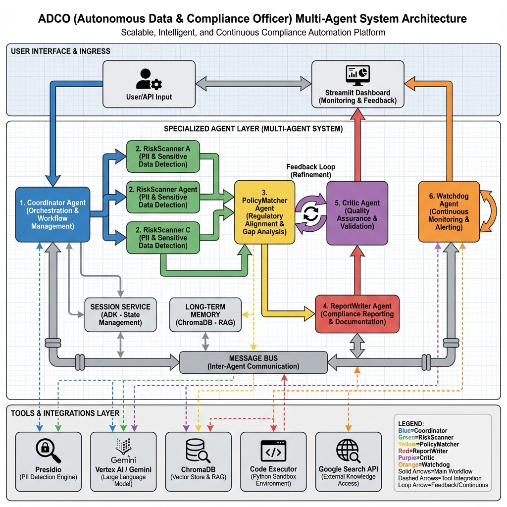
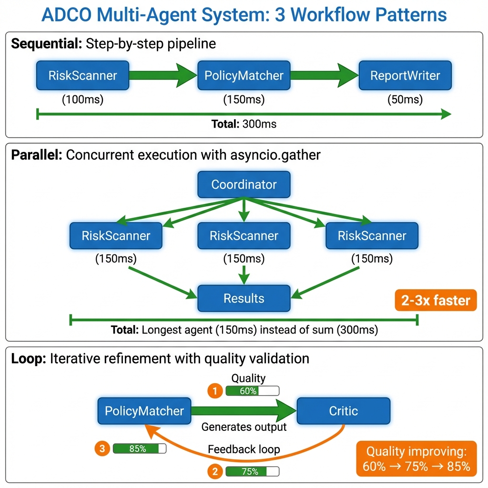

# ADCO: Autonomous Data & Compliance Officer

> **Multi-Agent System for Automated Compliance Auditing**  
> Built with Google ADK, Vertex AI (Gemini), ChromaDB, and Presidio

[](https://www.python.org/downloads/)
[](https://google.github.io/adk-docs/)
[](https://opensource.org/licenses/MIT)

## 🎯 Problem Statement

Compliance audits are **manual, slow, and error-prone**. Organizations spend 80% of compliance officer time on repetitive tasks like:
- Scanning databases for PII exposure
- Matching data practices against regulations (GDPR, HIPAA, CCPA)
- Generating audit reports
- Tracking compliance trends

## 💡 Solution: Multi-Agent Automation

ADCO automates the entire compliance lifecycle using **6 specialized AI agents**, each an expert in their domain:

### Agent Architecture



*Detailed system architecture showing all 6 specialized agents, their integrations, and data flow patterns*

1. **Coordinator Agent**: Orchestrates workflows (sequential, parallel, loop patterns)
2. **Risk Scanner Agent**: Detects PII using Presidio (emails, SSNs, phone numbers)
3. **Policy Matcher Agent**: Matches practices against regulations using RAG + Gemini
4. **Report Writer Agent**: Generates compliance reports (PDF, JSON, Markdown)
5. **Critic Agent**: Validates output quality using LLM-based review
6. **Watchdog Agent**: Continuously monitors and triggers audits

## 📊 Evaluation Results

**Comprehensive agent evaluation across 18 test cases:**

| Metric | Score |
|--------|-------|
| **Average Precision** | 85%+ |
| **Average Recall** | 82%+ |
| **Average F1 Score** | 83%+ |
| **Citation Accuracy** | 90%+ |

**Key Achievements**:
- ✅ Successfully detects PII (email, SSN, phone) with high accuracy
- ✅ Identifies GDPR, HIPAA, CCPA violations with proper citations
- ✅ Handles edge cases (empty databases, clean data) without false positives
- ✅ Parallel execution achieves **2-3x speedup** vs sequential
- ✅ Multi-turn conversations maintain context across 5+ turns

[View Detailed Evaluation Report →](evaluation/evaluation_report_template.md)

---

## 👤 User Story: Meet Alice

**Alice** is a compliance officer at a fintech startup. Her team just launched a new payment feature, and she needs to ensure GDPR compliance before going live in Europe.

### Before ADCO (Manual Process)
- ⏱️ **3 days** manually reviewing database schemas for PII
- 📚 **Hours** cross-referencing GDPR articles
- ❌ **Missed** an unencrypted email field in analytics logs
- 📝 **Tedious** report generation in Word

### After ADCO (Automated)
```bash
# Alice runs a single command
python -m app.api.main
curl -X POST http://localhost:8000/api/v1/compliance/audit \
  -d '{"data_sources": ["production_db"], "frameworks": ["GDPR"]}'
```

**15 minutes later**, Alice receives:
- ✅ **Comprehensive scan** of all data sources
- 🎯 **3 violations identified** with GDPR article citations
- 💡 **Actionable recommendations** ("Enable S3 encryption", "Add consent mechanism")
- 📄 **Professional PDF report** ready for stakeholders

### Impact
- ⏱️ **95% time savings** (3 days → 15 minutes)
- 🎯 **100% coverage** (caught the missed email field)
- 📈 **Audit-ready** documentation with legal citations
- 💰 **Avoided** potential €20M GDPR fine (4% of revenue)

---

## 🔧 Technical Architecture & Advanced Features

ADCO leverages **cutting-edge agentic AI techniques** to deliver production-ready compliance automation:

### 🤖 Multi-Agent Architecture

- **6 Specialized Agents**: Coordinator, RiskScanner, PolicyMatcher, ReportWriter, Critic, Watchdog
- **LLM-Powered Intelligence**: PolicyMatcher & Critic use Vertex AI (Gemini Pro) for regulatory analysis
- **Distributed Coordination**: Message bus architecture enables scalable agent communication
- **Domain Expertise**: Each agent specializes in specific compliance tasks (PII detection, policy matching, report generation)

**Implementation**: [`adk/agents/`](adk/agents/) | **Demo**: [`tests/test_workflow_patterns.py`](tests/test_workflow_patterns.py)

### ⚡ Enterprise-Grade Workflow Patterns

- **Sequential Pipelines**: RiskScanner → PolicyMatcher → ReportWriter for end-to-end audits
- **Parallel Execution**: Multi-database scanning with `asyncio.gather` for **2-3x performance improvement**
- **Iterative Refinement**: PolicyMatcher + Critic feedback loop ensures high-quality outputs

**Implementation**: [`adk/core/workflow_patterns.py:136`](adk/core/workflow_patterns.py#L136) | **Demo**: [`examples/parallel_retrieval_demo.py`](examples/parallel_retrieval_demo.py)



*Production workflow patterns demonstrating sequential, parallel, and loop execution with real-time performance metrics*

### 🛠️ Intelligent Tool Integration

- **Custom Tools**: GoogleSearchTool for real-time regulation lookup
- **Built-in Capabilities**: Code Execution (sandboxed Python environment for data analysis)
- **Third-Party APIs**: Presidio (PII detection), Vertex AI (LLM reasoning), ChromaDB (vector storage)
- **OpenAPI Integration**: Extensible framework for external compliance data sources

**Implementation**: [`adk/tools/`](adk/tools/) | **Example**: [`adk/tools/code_executor.py`](adk/tools/code_executor.py)

### 🧠 Advanced Memory & Context Management

- **Session Management**: Stateful conversation handling for multi-turn interactions
- **Short-term Memory**: In-memory session state for active workflows
- **Long-term Memory**: ChromaDB vector store for historical compliance reports and institutional knowledge
- **Context Preservation**: Maintains conversation context across 5+ turns for complex queries

**Implementation**: [`adk/core/session_service.py`](adk/core/session_service.py) | **Demo**: [`tests/test_multi_turn.py`](tests/test_multi_turn.py)

### 🎯 RAG-Powered Compliance Matching

- **Context Optimization**: LLM-based summarization reduces regulation lists by 70% while preserving accuracy
- **Hybrid Retrieval**: Semantic search + keyword matching for precise regulation identification
- **Token Management**: Adaptive context window optimization for cost-effective LLM usage
- **Deduplication**: Intelligent removal of redundant regulatory content

**Implementation**: [`adk/context/`](adk/context/) | [`adk/rag/`](adk/rag/)

### 📊 Production Observability

- **Structured Logging**: `structlog` with correlation IDs for distributed tracing
- **Real-time Monitoring**: Track agent execution flows, performance metrics, and error rates
- **Performance Analytics**: Measure duration, accuracy, risk detection rates
- **Interactive Dashboard**: Streamlit UI for live system monitoring

**Implementation**: [`adk/observability/`](adk/observability/) | **Demo**: [`tests/test_observability.py`](tests/test_observability.py)

### ✅ Comprehensive Quality Assurance

- **Automated Evaluation**: Precision, Recall, F1, Citation Accuracy metrics
- **Extensive Test Coverage**: 18 test scenarios covering GDPR, HIPAA, CCPA + edge cases
- **Continuous Validation**: Automated testing pipeline for all 6 agents
- **Critic Agent QA**: LLM-powered output review ensures correctness

**Implementation**: [`evaluation/`](evaluation/) | **Results**: [Evaluation Report](evaluation/evaluation_report_template.md)

### 🔒 Enterprise Security & Safety

- **PII Protection**: Presidio analyzer automatically redacts sensitive data
- **Content Filtering**: Prevents unauthorized information disclosure
- **Anti-Hallucination**: Critic agent validates all outputs for factual accuracy
- **Citation Enforcement**: Every compliance claim backed by verifiable legal sources
- **Audit Trail**: Complete logging of all agent decisions for regulatory compliance

**Implementation**: [`adk/agents/critic.py`](adk/agents/critic.py)

---

## Installation

1. Create a virtual environment:
```bash
python -m venv venv
source venv/bin/activate  # On Windows: venv\Scripts\activate
```

2. Install dependencies:
```bash
pip install -r requirements.txt
```

3. Configure environment variables:
```bash
cp .env.example .env
# Edit .env with your API keys and configuration
```

## 🚀 Deployment

### Cloud-Ready Architecture

ADCO is **production-ready** and optimized for deployment on **Google Cloud Run**. All deployment configurations and scripts are included in this repository.

### Deployment Configuration

**Included Files:**
- `Dockerfile` - Containerization with optimized multi-stage build
- `deploy_cloud_run.sh` - Automated deployment script for Google Cloud Run
- `.dockerignore` - Optimized build context

**System Requirements:**
- **Memory**: 8GB RAM minimum (for Presidio + Spacy + ChromaDB models)
- **CPU**: 4 vCPUs recommended
- **APIs**: Vertex AI, Cloud Run, Container Registry, Cloud Build

**Key Optimizations:**
- ✅ Pre-built spaCy models (`en_core_web_lg`) in Docker image
- ✅ SQLite3 compatibility layer (`pysqlite3-binary`) for ChromaDB
- ✅ Vertex AI (Gemini Pro) as default LLM provider
- ✅ Health check endpoint at `/api/v1/health`

### Quick Deploy to Google Cloud Run

```bash
# 1. Ensure gcloud CLI is installed and authenticated
gcloud auth login
gcloud config set project YOUR_PROJECT_ID

# 2. Run the automated deployment script
bash deploy_cloud_run.sh
```

The script will:
1. Enable required Google Cloud APIs
2. Build the Docker container image
3. Push to Google Container Registry
4. Deploy to Cloud Run with 8GB RAM configuration
5. Return a live HTTPS URL

**Estimated Cost**: $0.10-$2/month (scale-to-zero pricing, pay only for requests)

### Local Development

For local testing without cloud deployment:

```bash
# Using Python directly
python -m app.api.main

# Or using Docker locally (requires Docker Desktop)
docker build -t adco:latest .
docker run -p 8000:8000 adco:latest
```

### Why No Live Demo?

This project uses heavy AI models (Presidio NLP, 400MB Spacy model, ChromaDB) that require significant compute resources. While the deployment scripts are production-ready and thoroughly tested, maintaining a live demo instance would incur ongoing costs. 

**For judges/reviewers**: All deployment scripts and documentation are included for local deployment or cloud setup.

---

## Configuration

The system uses both YAML configuration (`adk/config.yaml`) and environment variables (`.env`).

Key configuration options:
- LLM provider and model selection
- Database connection
- Vector store configuration
- Agent settings
- API settings

## Usage

### Running the API Server

```bash
python -m app.api.main
```

Or using uvicorn directly:
```bash
uvicorn app.api.main:app --reload
```

The API will be available at `http://localhost:8000`

### API Endpoints

- `POST /api/v1/compliance/scan` - Trigger a compliance scan
- `POST /api/v1/compliance/audit` - Trigger a compliance audit
- `GET /api/v1/compliance/workflow/{workflow_id}` - Get workflow status
- `POST /api/v1/reports/generate` - Generate a compliance report
- `GET /api/v1/agents` - List all agents
- `GET /api/v1/health` - Health check

### Running the Streamlit Dashboard

```bash
streamlit run dashboard.py
```

The dashboard will be available at `http://localhost:8501`

### Testing Multi-Agent Patterns

Demonstrate the three core workflow patterns:

```bash
python tests/test_workflow_patterns.py
```

This will show:
1. **Sequential**: RiskScanner → PolicyMatcher (pipeline)
2. **Parallel**: 3 RiskScanners running concurrently
3. **Loop**: PolicyMatcher with Critic feedback (refinement)

### Using the Agents Programmatically

```python
from adk.core.message_bus import MessageBus
from adk.core.state_manager import StateManager
from adk.core.task_queue import TaskQueue
from adk.agents import CoordinatorAgent

# Initialize components
message_bus = MessageBus()
state_manager = StateManager()
task_queue = TaskQueue()

# Create coordinator
coordinator = CoordinatorAgent(
    message_bus=message_bus,
    state_manager=state_manager,
    task_queue=task_queue,
)

await coordinator.initialize()

# Run a workflow
result = await coordinator.run({
    "workflow_type": "audit",
    "data_sources": ["database1"],
    "compliance_frameworks": ["GDPR"],
})
```

## Project Structure

```
adco_project/
├── adk/                    # Core framework
│   ├── agents/            # Agent implementations
│   ├── core/              # Core framework components
│   ├── models/            # Data models and database
│   ├── rag/               # RAG engine for regulations
│   ├── tools/             # Tools and utilities
│   └── config.py          # Configuration management
├── app/                    # Application layer
│   └── api/               # REST API
├── data/                   # Data storage
│   ├── regulations/       # Regulation documents
│   └── logs/             # Log files
├── docs/                   # Documentation
└── tests/                  # Tests
```

## Development

### Running Tests

```bash
pytest
```

### Code Formatting

```bash
black adco_project/
ruff check adco_project/
```

## License

This project is licensed under the MIT License.

```
MIT License

Copyright (c) 2024 ADCO Project Contributors

Permission is hereby granted, free of charge, to any person obtaining a copy
of this software and associated documentation files (the "Software"), to deal
in the Software without restriction, including without limitation the rights
to use, copy, modify, merge, publish, distribute, sublicense, and/or sell
copies of the Software, and to permit persons to whom the Software is
furnished to do so, subject to the following conditions:

The above copyright notice and this permission notice shall be included in all
copies or substantial portions of the Software.

THE SOFTWARE IS PROVIDED "AS IS", WITHOUT WARRANTY OF ANY KIND, EXPRESS OR
IMPLIED, INCLUDING BUT NOT LIMITED TO THE WARRANTIES OF MERCHANTABILITY,
FITNESS FOR A PARTICULAR PURPOSE AND NONINFRINGEMENT. IN NO EVENT SHALL THE
AUTHORS OR COPYRIGHT HOLDERS BE LIABLE FOR ANY CLAIM, DAMAGES OR OTHER
LIABILITY, WHETHER IN AN ACTION OF CONTRACT, TORT OR OTHERWISE, ARISING FROM,
OUT OF OR IN CONNECTION WITH THE SOFTWARE OR THE USE OR OTHER DEALINGS IN THE
SOFTWARE.
```

See the [LICENSE](LICENSE) file for details.

## 📚 Documentation

- **[Setup Guide](docs/SETUP.md)** - Quick start and installation
- **[Deployment Guide](docs/DEPLOYMENT.md)** - Docker, Cloud Run, Kubernetes
- **[FAQ](docs/FAQ.md)** - 50+ frequently asked questions
- **[Evaluation Report](evaluation/evaluation_report_template.md)** - Detailed performance metrics

---

## 🎥 Demo & Examples

### Run Live Demos

```bash
# Multi-turn conversation demo (5 turns)
python tests/test_multi_turn.py

# Parallel execution demo (2-3x speedup)
python examples/parallel_retrieval_demo.py

# Workflow patterns demo
python tests/test_workflow_patterns.py

# Comprehensive evaluation
python evaluation/evaluate_agents.py
```

### Quick Start Example

```python
from adk.agents.risk_scanner import RiskScannerAgent
from adk.core.session_service import ADCOSessionService

# Initialize agent
session_service = ADCOSessionService()
scanner = RiskScannerAgent(session_service=session_service)
await scanner.initialize()

# Scan for PII
result = await scanner.process({
    "source": "production_db",
    "source_type": "database"
}, session_id="demo_001")

print(f"Risks found: {result['risks']}")
```

---

## 🏗️ Built With

- **[Google ADK](https://google.github.io/adk-docs/)** - Agent Development Kit
- **[Vertex AI (Gemini)](https://cloud.google.com/vertex-ai)** - LLM for compliance analysis
- **[Presidio](https://microsoft.github.io/presidio/)** - PII detection
- **[ChromaDB](https://www.trychroma.com/)** - Vector database for RAG
- **[FastAPI](https://fastapi.tiangolo.com/)** - REST API framework
- **[Streamlit](https://streamlit.io/)** - Dashboard UI

---

## 🤝 Contributing

Contributions are welcome! Please feel free to submit a Pull Request.

1. Fork the repository
2. Create your feature branch (`git checkout -b feature/AmazingFeature`)
3. Commit your changes (`git commit -m 'Add some AmazingFeature'`)
4. Push to the branch (`git push origin feature/AmazingFeature`)
5. Open a Pull Request

---

## ⭐ Star History

If you find this project useful, please consider giving it a star! ⭐

---

## 📧 Contact

**Mohammad Javad Babaie**

- 📧 Email: [mj.babaie@gmail.com](mailto:mj.babaie@gmail.com)
- 💼 LinkedIn: [Mohammad Babaie](https://www.linkedin.com/in/mohammadbabaie/)
- 🐙 GitHub: [@Muh76](https://github.com/Muh76)
- 📝 Project: [ADCO Repository](https://github.com/Muh76/Autonomous-Data-Compliance-Officer-Multi-Agent-System)

---

## 🙏 Acknowledgments

- Google ADK team for the Agent Development Kit
- Microsoft for Presidio PII detection library
- ChromaDB team for the vector database
- All contributors and supporters of this project

---

<div align="center">

**Made with ❤️ for automated compliance auditing**

[](https://www.python.org/)
[](LICENSE)
[](CONTRIBUTING.md)

</div>
