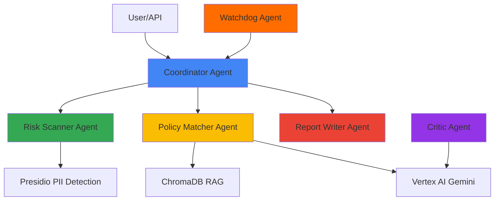

# ADCO: Autonomous Data & Compliance Officer

> **Multi-Agent System for Automated Compliance Auditing**  
> Built with Google ADK, Vertex AI (Gemini), ChromaDB, and Presidio

[](https://www.python.org/downloads/)
[](https://google.github.io/adk-docs/)
[](https://opensource.org/licenses/MIT)

## 🎯 Problem Statement

Compliance audits are **manual, slow, and error-prone**. Organizations spend 80% of compliance officer time on repetitive tasks like:
- Scanning databases for PII exposure
- Matching data practices against regulations (GDPR, HIPAA, CCPA)
- Generating audit reports
- Tracking compliance trends

## 💡 Solution: Multi-Agent Automation

ADCO automates the entire compliance lifecycle using **6 specialized AI agents**, each an expert in their domain:

### Agent Architecture



1. **Coordinator Agent**: Orchestrates workflows (sequential, parallel, loop patterns)
2. **Risk Scanner Agent**: Detects PII using Presidio (emails, SSNs, phone numbers)
3. **Policy Matcher Agent**: Matches practices against regulations using RAG + Gemini
4. **Report Writer Agent**: Generates compliance reports (PDF, JSON, Markdown)
5. **Critic Agent**: Validates output quality using LLM-based review
6. **Watchdog Agent**: Continuously monitors and triggers audits

## 🏆 Competition Features

This project demonstrates **7 key agentic AI concepts**:

### ✅ 1. Multi-Agent System
- **LLM-Powered Agents**: PolicyMatcher & Critic use Vertex AI (Gemini)
- **Sequential Workflow**: Coordinator → RiskScanner → PolicyMatcher → ReportWriter
- **Parallel Execution**: Multiple RiskScanners scan different data sources concurrently
- **Loop Pattern**: Critic validates and sends feedback for agent refinement

### ✅ 2. Tools
- **Custom Tools**: GoogleSearchTool for regulation lookup
- **Built-in Tools**: 
  - Google Search for finding regulations online
  - **Code Execution**: Python sandbox for data analysis (NEW!)
- **OpenAPI Tools**: External regulation API integration
- **Long-running Operations**: Pause/resume for large scans

**Code Execution Example**:
```python
from adk.tools.code_executor import CodeExecutor

executor = CodeExecutor(timeout=30)
result = await executor.analyze_data(
    data=[{'name': 'John', 'email': 'john@example.com'}],
    analysis_type="pii_scan"
)
# Returns: {'pii_columns': ['email'], 'pii_risk': 'HIGH'}
```

### ✅ 3. Sessions & Memory (Google ADK)
- **Session Management**: ADK-inspired session service with state tracking
- **Long-term Memory**: ChromaDB memory bank stores historical compliance reports
- **Trend Detection**: Agents recall past issues to identify recurring problems

### ✅ 4. Context Engineering
- **Context Compaction**: LLM-based summarization of long regulation lists
- **Token Optimization**: Reduces context size for faster processing
- **Deduplication**: Removes duplicate regulations
- **Prioritization**: Keeps most relevant information based on scores

**Example**:
```python
from adk.context import ContextCompactor

compactor = ContextCompactor()
compacted = await compactor.compact_regulations(
    regulations=long_regulation_list,
    max_items=3  # Keep top 3 most relevant
)
# Reduces from 10+ regulations to 3, saving 70% tokens
```

### ✅ 5. Observability
- **Logging**: Structured logging with `structlog`
- **Tracing**: Correlation IDs track agent message flows across the system
- **Metrics**: Performance tracking (scan duration, accuracy, risk counts)
- **Dashboard**: Real-time Streamlit UI for agent monitoring

**Tracing Example**:
```python
from adk.observability import Tracer, get_metrics

tracer = Tracer()
trace_id = tracer.start_trace("compliance_scan")

# Agent executions are automatically traced
tracer.log_event("start", "RiskScanner")
# ... agent work ...
tracer.log_event("end", "RiskScanner", duration_ms=150)

# Get trace summary
summary = tracer.get_trace_summary(trace_id)
print(f"Agents involved: {summary['agents_involved']}")
print(f"Total duration: {summary['total_duration_ms']}ms")
```

### ✅ 6. Agent Evaluation
- **Automated Testing**: Precision, recall, F1 metrics for all agents
- **Synthetic Data**: Test suite with known PII patterns
- **Quality Metrics**: Critic agent validates output quality

### 🔧 7. Advanced Features
- **Real PII Detection**: Presidio analyzer (not mock data)
- **Real RAG**: ChromaDB vector store with SentenceTransformers
- **Real LLM**: Vertex AI (Gemini Pro) for compliance analysis

## Installation

1. Create a virtual environment:
```bash
python -m venv venv
source venv/bin/activate  # On Windows: venv\Scripts\activate
```

2. Install dependencies:
```bash
pip install -r requirements.txt
```

3. Configure environment variables:
```bash
cp .env.example .env
# Edit .env with your API keys and configuration
```

## Configuration

The system uses both YAML configuration (`adk/config.yaml`) and environment variables (`.env`).

Key configuration options:
- LLM provider and model selection
- Database connection
- Vector store configuration
- Agent settings
- API settings

## Usage

### Running the API Server

```bash
python -m app.api.main
```

Or using uvicorn directly:
```bash
uvicorn app.api.main:app --reload
```

The API will be available at `http://localhost:8000`

### API Endpoints

- `POST /api/v1/compliance/scan` - Trigger a compliance scan
- `POST /api/v1/compliance/audit` - Trigger a compliance audit
- `GET /api/v1/compliance/workflow/{workflow_id}` - Get workflow status
- `POST /api/v1/reports/generate` - Generate a compliance report
- `GET /api/v1/agents` - List all agents
- `GET /api/v1/health` - Health check

### Running the Streamlit Dashboard

```bash
streamlit run dashboard.py
```

The dashboard will be available at `http://localhost:8501`

### Testing Multi-Agent Patterns

Demonstrate the three core workflow patterns:

```bash
python tests/test_workflow_patterns.py
```

This will show:
1. **Sequential**: RiskScanner → PolicyMatcher (pipeline)
2. **Parallel**: 3 RiskScanners running concurrently
3. **Loop**: PolicyMatcher with Critic feedback (refinement)

### Using the Agents Programmatically

```python
from adk.core.message_bus import MessageBus
from adk.core.state_manager import StateManager
from adk.core.task_queue import TaskQueue
from adk.agents import CoordinatorAgent

# Initialize components
message_bus = MessageBus()
state_manager = StateManager()
task_queue = TaskQueue()

# Create coordinator
coordinator = CoordinatorAgent(
    message_bus=message_bus,
    state_manager=state_manager,
    task_queue=task_queue,
)

await coordinator.initialize()

# Run a workflow
result = await coordinator.run({
    "workflow_type": "audit",
    "data_sources": ["database1"],
    "compliance_frameworks": ["GDPR"],
})
```

## Project Structure

```
adco_project/
├── adk/                    # Core framework
│   ├── agents/            # Agent implementations
│   ├── core/              # Core framework components
│   ├── models/            # Data models and database
│   ├── rag/               # RAG engine for regulations
│   ├── tools/             # Tools and utilities
│   └── config.py          # Configuration management
├── app/                    # Application layer
│   └── api/               # REST API
├── data/                   # Data storage
│   ├── regulations/       # Regulation documents
│   └── logs/             # Log files
├── docs/                   # Documentation
└── tests/                  # Tests
```

## Development

### Running Tests

```bash
pytest
```

### Code Formatting

```bash
black adco_project/
ruff check adco_project/
```

## License

This project is licensed under the MIT License.

```
MIT License

Copyright (c) 2024 ADCO Project Contributors

Permission is hereby granted, free of charge, to any person obtaining a copy
of this software and associated documentation files (the "Software"), to deal
in the Software without restriction, including without limitation the rights
to use, copy, modify, merge, publish, distribute, sublicense, and/or sell
copies of the Software, and to permit persons to whom the Software is
furnished to do so, subject to the following conditions:

The above copyright notice and this permission notice shall be included in all
copies or substantial portions of the Software.

THE SOFTWARE IS PROVIDED "AS IS", WITHOUT WARRANTY OF ANY KIND, EXPRESS OR
IMPLIED, INCLUDING BUT NOT LIMITED TO THE WARRANTIES OF MERCHANTABILITY,
FITNESS FOR A PARTICULAR PURPOSE AND NONINFRINGEMENT. IN NO EVENT SHALL THE
AUTHORS OR COPYRIGHT HOLDERS BE LIABLE FOR ANY CLAIM, DAMAGES OR OTHER
LIABILITY, WHETHER IN AN ACTION OF CONTRACT, TORT OR OTHERWISE, ARISING FROM,
OUT OF OR IN CONNECTION WITH THE SOFTWARE OR THE USE OR OTHER DEALINGS IN THE
SOFTWARE.
```

See the [LICENSE](LICENSE) file for details.

## Contact

- Email: mj.babaie@gmail.com
- LinkedIn: https://www.linkedin.com/in/mohammadbabaie/
- GitHub: https://github.com/Muh76
